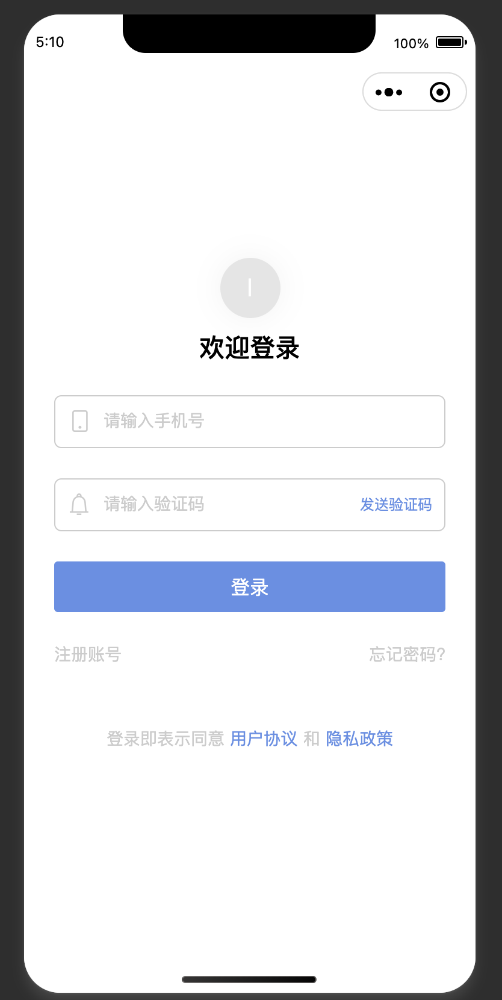
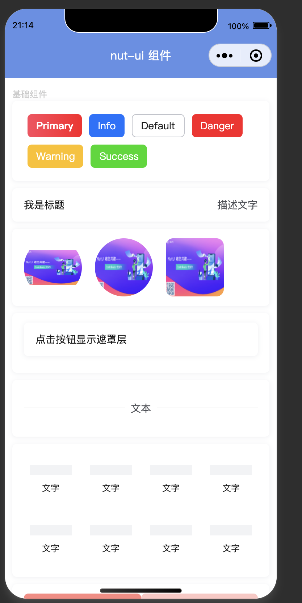
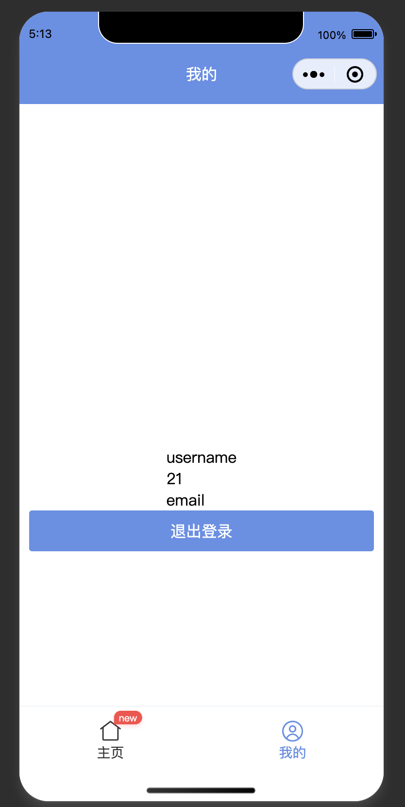

# taro_default
#### a default taro project,if you want make a taro project quicky, you can use it

# 项目说明
### nutUi+mobx+react实现的一个微信小程序，可用于快速建立一个模版小程序，包括登录信息存取，顶部导航条封装，请求封装，无限加载列表封装等。用于快速开发一个通用的微信小程序。

